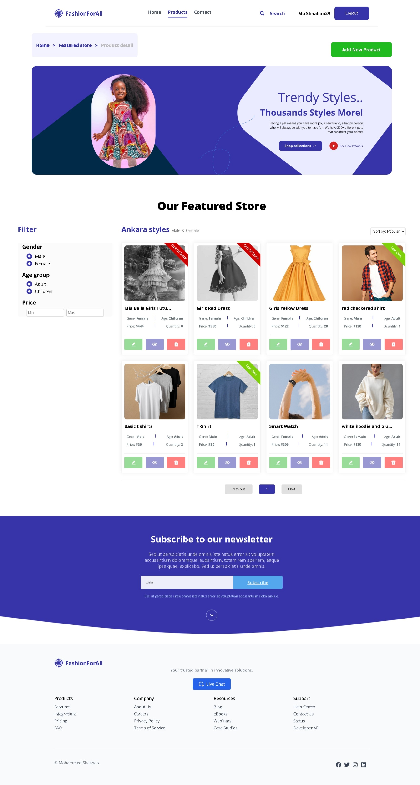

# Fashion for All

Welcome to "Fashion for All" - an inclusive e-commerce platform offering a wide range of fashion products for everyone. This project is developed by Mohamed Shaaban (ID: 29) as part of the ITI final project.


## Table of Contents

1. [Description](#description)
2. [Features](#features)
3. [Project Structure](#project-structure)
4. [Installation](#installation)
5. [Usage](#usage)
6. [Technologies Used](#technologies-used)
7. [Contributing](#contributing)
8. [License](#license)
9. [Contact](#contact)

## Project Structure

```
src/
│
├── components/
│ ├── MainFooter/
│ │ ├── MainFooter.jsx
│ │ └── MainFooter.css
│ │
│ ├── Authentication/
│ │ ├── UserLoginForm.jsx
│ │ └── UserLoginForm.css
│ │
│ ├── Home/
│ │ ├── HomeBanner/
│ │ │ ├── HomeBanner.jsx
│ │ │ └── HomeBanner.css
│ │ ├── HomeFAQ/
│ │ │ ├── HomeFAQ.jsx
│ │ │ └── HomeFAQ.css
│ │ ├── HomeHeroSection/
│ │ │ ├── HomeHeroSection.jsx
│ │ │ └── HomeHeroSection.css
│ │ ├── CustomerTestimonials/
│ │ │ ├── CustomerTestimonials.jsx
│ │ │ └── CustomerTestimonials.css
│ │ ├── NewsletterSubscription/
│ │ │ ├── NewsletterSubscription.jsx
│ │ │ └── NewsletterSubscription.css
│ │ ├── OurServices/
│ │   ├── OurServices.jsx
│ │   └── OurServices.css
│ │
│ │
│ ├── MainNavbar/
│ │ ├── MainNavbar.jsx
│ │ └── MainNavbar.css
│ │
│ └── Products/
│ ├── PageNavigation/
│ │ ├── PageNavigation.jsx
│ │ └── PageNavigation.css
│ ├── ProductList/
│ │ ├── ProductList.jsx
│ │ └── ProductList.css
│ ├── ProductDetails/
│ │ ├── ProductDetails.jsx
│ │ └── ProductDetails.css
│ ├── ProductImageSlider/
│ │ ├── ProductImageSlider.jsx
│ │ └── ProductImageSlider.css
│ ├── ProductEditForm/
│ │ ├── ProductEditForm.jsx
│ │ └── ProductEditForm.css
│ ├── FeaturedProducts/
│ │ ├── FeaturedProducts.jsx
│ │ ├── FeaturedProducts.css
│ │ ├── FeaturedProductsFilter.jsx
│ │ └── FeaturedProductsFilter.css
│ └── ...
│
├── pages/
│ ├── Home.jsx
│ ├── NotFound.jsx
│ ├── ProductListPage.jsx
│ ├── ProductEditPage.jsx
│ └── ProductDetailsPage.jsx
│
└── assets/
```

## Description

"Fashion for All" is a user-friendly e-commerce website that enables users to browse and purchase fashion items with ease. The platform offers a seamless shopping experience with features like product filtering, pagination, and personalized user accounts. Our goal is to make fashion accessible and enjoyable for everyone.

## Features

### User Authentication

- Secure login page for user access
- First-time login information stored in local storage
- Automatic redirection to home page upon successful login


### Home Page

- Elegant and attractive design for enhanced user experience
- Intuitive navigation to different sections of the website


### Product Page

- Display of a wide variety of products
- Advanced filtering options:
  - By type
  - By age
  - By price (lowest to highest or highest to lowest)



### Product Pagination

- Easy navigation through multiple pages of products
- Improved user experience for browsing large product catalogs

### Single Product Page

- Detailed view of individual products
- Comprehensive information including description, price, and availability


### Admin Features

- Add new products to the catalog
- Update existing product information


### Stock Indicators

- "Out of stock" banner for products with 0 quantity
  - Product image displayed in black and white
- "Last one" banner for products with only 1 item left in stock


## Installation

1. Clone the repository:
   ```
   git clone https://github.com/yourusername/fashion-for-all.git
   ```
2. Navigate to the project directory:
   ```
   cd fashion-for-all
   ```
3. Install dependencies:
   ```
   npm install
   ```

## Usage

1. Start the development server:
   ```
   npm start
   ```
2. Open your browser and visit `http://localhost:3000`

## Technologies Used

- React.js
- CSS3
- [Add any other technologies, libraries, or frameworks used]

## Contributing

We welcome contributions to Fashion for All! Please follow these steps:

1. Fork the repository
2. Create a new branch: `git checkout -b feature/your-feature-name`
3. Make your changes and commit them: `git commit -m 'Add some feature'`
4. Push to the branch: `git push origin feature/your-feature-name`
5. Submit a pull request

## License

[Specify the license under which your project is released]

## Contact

Mohamed Shaaban - [Your Email]

Project Link: [https://github.com/yourusername/fashion-for-all](https://github.com/yourusername/fashion-for-all)
